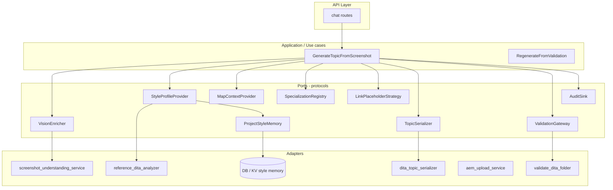

# AEM Guides–oriented authoring: modular architecture (extension design)

This document describes how to evolve the existing screenshot + reference guided pipeline into an **enterprise structured authoring** feature without a rewrite. It is grounded in the current codebase layout under `backend/app/services/`, `backend/app/core/schemas_chat_authoring.py`, and the chat authoring route.

## 1. Current state (inventory)

| Area | Primary modules today |
|------|------------------------|
| Vision / screenshot IR | `screenshot_understanding_service.py`, `ScreenshotContentModel` |
| Reference style | `reference_dita_analyzer.py`, `ReferenceStyleProfile`, `ChatReferenceDitaSummary` |
| Plan + merge | `dita_topic_draft.py` (`ChatSemanticPlan`, `merge_structured_into_plan`, `infer_topic_type`) |
| Serialization | `structured_topic_draft.py` (stub), `dita_topic_serializer.py` |
| Validation | `dita_authoring_structure.py`, `utils/dita_validator.py`, `smart_suggestions_service.build_review_snapshot` |
| Orchestration | `chat_dita_authoring_service.py` (monolithic pipeline) |
| Persistence / assets | `chat_asset_service.py`, optional AEM save env vars |
| API surface | `api/v1/routes/chat.py` (`post_send_authoring_message`), `ChatAuthoringRequestPayload` |

**Gap:** orchestration, context, and policies are largely **inside one service class**, which makes it harder to plug project memory, map context, specialization, and audit sinks without copy-paste.

## 2. Design goals (differentiation axes)

1. **Project-specific style memory** — durable profiles keyed by tenant/project, not only per-upload reference.
2. **DITA specialization awareness** — allow roots/structures beyond base `task|concept|reference|topic` when configured.
3. **Map-aware generation** — topic fits a `ditamap` (placement, keys, hierarchy, chunking hints).
4. **Safe xref/conref placeholders** — explicit strategy interface (omit vs `ph` vs keyref placeholders), validated against policy.
5. **AEM Guides–friendly conventions** — outputclass, folder paths, metadata, review states (as data, not hardcoded strings scattered in prompts).
6. **Reference reuse without broken deps** — never emit `href`/`conref`/`keyref` the validator cannot justify; optional “suggested key” list from map.
7. **Validation-aware regeneration** — structured feedback loop: validation deltas → targeted repair plan → re-run step.
8. **Enterprise auditability** — immutable run records: inputs hashes, model IDs, policy version, validation snapshots.

## 3. Modular architecture (layers)

Use a **hexagonal / ports-and-adapters** style inside the backend: keep **domain types** pure, **use cases** orchestrate, **adapters** talk to LLM, AEM, DB, filesystem.



**Rule:** `ChatDitaAuthoringService` becomes a **thin façade** that builds an `AuthoringSessionContext`, invokes `GenerateTopicFromScreenshot` (and later `RegenerateFromValidation`), and maps results to `ChatDitaAuthoringResult`.

## 4. Typed contracts (recommended Pydantic / dataclasses)

Introduce a dedicated package to avoid bloating `schemas_chat_authoring.py` endlessly:

**Suggested path:** `backend/app/authoring/` (or `backend/app/domain/authoring/`)

| Type | Responsibility |
|------|----------------|
| `AuthoringSessionContext` | `tenant_id`, `project_id`, `user_id`, `session_id`, `request_id`, timestamps, feature flags version |
| `AuthoringInputBundle` | Normalized attachments (image ref, optional reference DITA text, optional **map snippet** / map asset id) |
| `MapContext` | Root map href, parent topicref hints, keydef subset (allowed keys only), `topic_id` allocation namespace |
| `SpecializationDescriptor` | Allowed root QNames or local names, DOCTYPE or schema ref id, allowed block/inline subsets (ids only, not full grammar) |
| `EnterpriseStyleProfile` | Superset of `ReferenceStyleProfile` + **source** (`reference_upload` \| `project_memory` \| `merged`) + `profile_version` |
| `LinkPolicy` | `mode: omit \| ph_placeholder \| keyref_placeholder \| xref_tbd`, forbidden patterns, max placeholder count |
| `ValidationSnapshot` | Normalized copy of `ChatDitaValidationResult` + raw validator output refs |
| `AuthoringRunRecord` | Input hashes, prompts hash, model ids, `ValidationSnapshot`, outcome, for audit |

Keep **wire models** (`ChatDitaAuthoringResult`, `ChatAuthoringRequestPayload`) stable; map from domain result → wire DTO in one place (`to_chat_result()`).

## 5. Extension points (concrete)

### 5.1 Protocols (typing.Protocol) in `authoring/ports.py`

- `VisionEnricher` — `enrich(image, prompt) -> ChatImageContext`
- `StyleProfileProvider` — `resolve(context, reference_text | None) -> EnterpriseStyleProfile`
- `MapContextProvider` — `load(context) -> MapContext | None` (starts as no-op)
- `SpecializationRegistry` — `resolve(dita_type_hint, tenant, project) -> SpecializationDescriptor`
- `LinkPlaceholderStrategy` — `apply(xml: str, policy: LinkPolicy, map: MapContext | None) -> str`
- `ValidationGateway` — `validate(xml, descriptor, context) -> ValidationSnapshot` (wraps folder + structural + AEM review)
- `AuditSink` — `emit(AuthoringRunRecord) -> None` (log-only first, then DB)

**Registration:** small `AuthoringContainer` or FastAPI `Depends()` providers that default to today’s implementations.

### 5.2 Pipeline steps as composable functions

Replace implicit ordering inside `generate_topic_from_request` with explicit steps (each pure where possible):

1. `collect_inputs` → `AuthoringInputBundle`
2. `run_vision` → `ChatImageContext`
3. `resolve_style` → `EnterpriseStyleProfile`
4. `resolve_map_context` → `MapContext | None`
5. `build_semantic_plan` (LLM or rules) → `ChatSemanticPlan`
6. `merge_screenshot_ir` → plan
7. `infer_or_override_topic_type` → `ChatDitaType` + confidence
8. `build_draft` → `TopicDraft` / future `StructuredTopicDraft`
9. `serialize` → XML string
10. `apply_link_policy` → XML string
11. `validate` → `ValidationSnapshot`
12. `maybe_repair` (optional loop) → XML + snapshot
13. `persist_artifact` + `audit`

Each step accepts `AuthoringSessionContext` + prior artifacts; failures return typed `AuthoringStepError` (code, message, retryable).

### 5.3 Policy and memory

- **Project style memory:** `MemoryPort` keyed by `(tenant_id, project_id)` returning `EnterpriseStyleProfile` merged with upload reference (precedence rules in one function `merge_style_profiles()`).
- **Specialization:** `SpecializationRegistry` backed by static YAML/JSON per tenant or DB row; serializer asks registry for **root element name** and **body wrapper** instead of hardcoded `taskbody`/`conbody`/`refbody` only (phased: start with alias map `task -> task`, later custom roots).
- **Map-aware generation:** `MapContext` passed into prompt JSON and serializer id generation (`topic_id` prefix from map key space); **no** automatic `topicref` write until Phase 3.

### 5.4 Validation-aware regeneration

- Add `RegenerateFromValidation` use case: input = previous `AuthoringRunRecord` id + user override text; load snapshot; build **repair plan** JSON (subset of issues); call LLM or rule repair; re-validate. Reuse `fix_all_safe` as adapter behind `RepairStrategy` protocol.

### 5.5 Auditability

- At start of run: `request_id = uuid4()`, log `authoring_run_started` with non-PII metadata.
- Store **SHA-256** of reference DITA and generated XML (or storage path), model name/version from env, `LinkPolicy` version, `SpecializationDescriptor` id.
- Do **not** log full screenshot bytes in structured logs; log asset id only.

## 6. Concrete code structure (recommended)

```
backend/app/authoring/
  __init__.py
  context.py              # AuthoringSessionContext, AuthoringInputBundle
  contracts.py            # MapContext, SpecializationDescriptor, EnterpriseStyleProfile, LinkPolicy
  ports.py                # Protocols
  pipeline/
    generate_topic.py     # orchestrated steps
    regenerate.py         # validation-aware (later)
  policies/
    link_placeholder.py   # default strategies
    style_merge.py        # reference + memory merge
  adapters/
    vision_openai.py      # wraps extract_screenshot_context
    style_from_reference.py
    style_from_memory.py  # stub → DB later
    validation_composite.py
  mappers.py              # domain -> ChatDitaAuthoringResult
```

Keep existing modules as **adapters** initially (thin wrappers calling current functions).

**Frontend:** introduce `AuthoringSessionMeta` in API payload (`context.project_id`, `context.map_asset_id`) passed through `ChatAuthoringRequestPayload.context` (already `dict | None` — formalize keys in a TS interface).

## 7. Phased roadmap

| Phase | Scope | Outcome |
|-------|--------|---------|
| **0 — Stabilize boundaries** | Extract `AuthoringSessionContext`, step functions from `ChatDitaAuthoringService`, add `ports.py` with default adapters | Same behavior, clearer seams |
| **1 — Contracts + link policy** | `LinkPolicy`, `LinkPlaceholderStrategy`, `EnterpriseStyleProfile` with `source`; wire `xref_placeholders` to strategy | Safe, testable link behavior |
| **2 — Project memory** | `MemoryPort` + DB or reuse tenant config store; `merge_style_profiles`; API `project_id` | Differentiation from one-off reference |
| **3 — Map context** | `MapContext` + parse minimal `.ditamap` for keydefs/parent path; prompt + id namespace only | Map-aware generation (no auto map edit) |
| **4 — Specialization registry** | Config-driven roots and body tags; extend serializer via registry hooks | Specialized topics |
| **5 — Audit + regen** | `AuthoringRunRecord` persistence, UI “fix validation issues”, `RegenerateFromValidation` | Enterprise audit + closed loop |

## 8. Principles (avoid commodity positioning)

- Treat **screenshot IR** as *evidence*, not the *spec*; **map + project policy** is the spec.
- Never emit **unresolved** `href`/`conref`/`keyref` by default; strategy is explicit and tested.
- **Validation** is a first-class output that drives regen, not a boolean afterthought.
- **Style** is versioned and attributable (reference vs memory vs merge).

---

*This document is advisory; implement Phase 0 incrementally behind feature flags if needed.*
